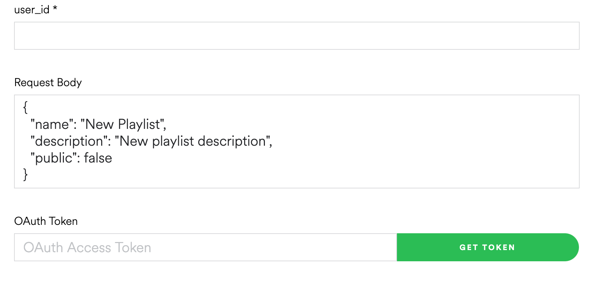

## AlarmBot - ECE 4180

Andrew Lang, Chase Hall, Kyeomeun Jang, William Hamil

### Background
This project creates an RC robot alarm clock. The idea is that you can set an alarm clock using a web interface hosted on a Raspberry Pi.  The Pi then sends the current time and alarm time to the MBED. Once the alarm goes off, the robot will drive away and force you out of bed to turn off the alarm. The movement will be mostly random for the robot, but will include collision detection using a sonar module. The alarm can be turned off or snoozed using the onboard buttons. The alarm tone will be played using a Pi interfacing with Spotify; this will allow you to set the soundtrack for your alarm. An LCD will display the current time and alarm time while inactive. If the alarm is activated the LCD will flash telling you to wake up. 

### Parts List
- ARM mbed
- Raspberry Pi Zero W
- Sonar (HC-SR04)
- Sparkfun Dual H-Bridge Motor Driver
- (2x) Sparkfun Shadow Chassis
- (2x) Sparkfun Hobby Gearmotor - 140 RPM
- (2x) Sparkfun Wheel - 65mm
- (3x) DC Battery Pack
- (2x) Breadboard Barrel Jack Adapter
- MicroUSB to DC Barrel Jack
- (12x) AA Batteries
- Sparkfun MiniUSB Breakout Board
- Sparkfun USB-A Breakout Board
- uLCD-144-G2 LCD Screen
- (2x) USB-A to MiniUSB Cable
- Adafruit Stereo Bonnet Pack for Raspberry Pi Zero W
- Raspberry Pi cobbler
- Wires
- Breadboards

## Setup
The following connections need to be made to the MBED for all of the components to work.  Note that while VU on the MBED does supply 5V, the motors draw more current than provided and need to be connected direclty to the battery packs.  The MBED is powered by a USB-A to MiniUSB cable connected to the USB-A breakout board; the breakout board is connected directly to a barrel jack adapter and has no data connections.
The Raspberry Pi can be powered using the DC to microUSB adapter with its own battery pack.  The Pi GPIO pins are connected to the audio bonnet and the bonnet pins can be connected to a Pi cobbler for a breadboard connection.

### Motor Connections

| MBED | H-Bridge | L-Motor | R-Motor |
| ---- | -------- | ------- | ------- |
| 5V   | VM       |         |         |
| VOUT | VCC      |         |         |
| GND  | GND      |         |         |
| p21  | AI1      |         |         |
| p22  | AI2      |         |         |
| p23  | PWMA     |         |         |
| p24  | BI1      |         |         |
| p25  | BI2      |         |         |
| p26  | PWMB     |         |         |
| VOUT | STBY     |         |         |
|      | A01      | -       |         |
|      | A02      | +       |         |
|      | B01      |         | -       |
|      | B02      |         | +       |

### miniUSB Connections

| MBED | miniUSB |
| ---- | ------- |
| VOUT | VCC     |
| D-   | D-      |
| D+   | D+      |
|      | ID      |
| GND  | GND     |

### uLCD Connections

| MBED | uLCD |
| ---- | ---- |
| 5V   | +5V  |
| p27  | RX   |
| p28  | TX   |
| p30  | RES  |
| GND  | GND  |

### Bluetooth Connections

| MBED | Bluetooth |
| ---- | --------- |
| GND  | GND       |
| 5V   | Vin       |
|      | RTS       |
| GND  | CTS       |
| p13  | TX        |
| p14  | RX        |

### Sonar Connections (HC-SR04)

| MBED | Sonar |
| ---- | ----- |
| VOUT | VCC   |
| p6   | Trig  |
| p7   | Echo  |
| GND  | GND   |

### MBED Button Connections

| MBED | Alarm_Snooze | Alarm_Off | Alarm_Set |
| ---- | ------------ | --------- | --------- |
| p19  |      +       |           |           | 
| p20  |              |     +     |           | 
| GND  |      -       |     -     |      -    | 

### Raspberry Pi Button Connections

|  Pi  | Alarm_Snooze | Alarm_Off | Alarm_Set |
| ---- | ------------ | --------- | --------- |
| p2   |              |     +     |           | 
| p3   |              |           |     +     |
| p4   |      +       |           |           | 
| GND  |      -       |     -     |     -     | 

### Schematic


### Raspberry Pi Set Up
1. Set up for the website
  1) Set up nginx 
https://www.raspberrypi.org/documentation/remote-access/web-server/nginx.md
- index.php will be used as our web page.
  2) Change the permission of the text files
- Since the song and alarm time are stored in the text file through php file, the ownership of these files should be changed.
```markdown
chown -R www-data:www-data (directory of song.txt and alarm.txt)
```
2. Set up for the Spotify on the Raspberry Pi
  1) Setup Spotify connection  
https://pimylifeup.com/raspberry-pi-spotify/
  2) Setup Spotify api
  - In order to run spotify directly on a Raspberry pi, the Spotify API is used.
  - This needs two information: User Id, and Oauth Token
    * User ID: Log into Spotify -> [Account Overview](https://www.spotify.com/us/account/overview/) : it's **Username**
    
    * Oauth Token: [Get Oauth](https://developer.spotify.com/console/post-playlists/) -> click the **Get Token** button
    
    
  - Enter User Id and Oauth Token to spotify_token and spotify_user_id at secrets.py
### MBED Code

#### Required Libraries

- mbed.h
- [rtos.h](https://os.mbed.com/handbook/RTOS)
- [Motor.h](https://os.mbed.com/cookbook/Motor)
- [uLCD_4DGL.h](https://os.mbed.com/users/4180_1/notebook/ulcd-144-g2-128-by-128-color-lcd/)
- [ultrasonic.h](https://os.mbed.com/components/HC-SR04/)
- [USBSerial.h](https://os.mbed.com/handbook/USBSerial)

#### Main.cpp

```markdown
/*
ECE 4180 Final Project
Alarm Bot by Chase Hall, William Hamil, Kyeomeun Jang, and Andrew Lang
This alarm clock is mounted on a robot, which drives away from you when the alarm sounds, making you get out of bed
and turn it off. The alarm time can be set and snoozed from a Bluetooth app, but can only be turned via a button on the robot itself
*/

///   preprocessor directives   
#include "mbed.h"
#include "rtos.h"
#include "Motor.h"
#include "uLCD_4DGL.h"
#include "ultrasonic.h"
#include "USBSerial.h"
#include <string>
#define ALARM_OFF       0                                                       // names for the alarm status, power up in ALARM_OFF
#define ALARM_ON        1                                                       // robot travels randomly in this state
#define ALARM_SNOOZE    2                                                       // robot doesn't travel in this state, but there is a timer waiting to put it back in ALARM_ON
#define ALARM_ON_HAZARD 3                                                       // if a hazard is present when the alarm is on, the movement is no longer random 
#define ALARM_SHUTOFF   4                                                       // ALARM_OFF is idle state, this is the state for when the alarm is physically turned off
#define NULL            0
#define SNOOZE_TIME     1                                                       // minutes of snooze to do


///   Declaring all global variables, mutex's, and volatile globals
Mutex uLCD_mutex;                                                               // LCD will be written by updating alarm time, updating current time, and when alarm goes off
Mutex PC_mutex;                                                                 // The PC Serial port can be written by either Bluetooth or the Pi when debugging
volatile unsigned int alarmState = ALARM_OFF;                                   // power up with alarm off
volatile uint8_t buffy[128];
struct tm alarm_time;                                                           // The alarm time, to be written by the Pi at the beginning of execution

unsigned int flashRed = 0xFF0000;                                               // the color to flash when the alarm is going off (RED)
void dist (int distance);                                                       // declaring the interrupt routine for sonar
void SnoozeOver();                                                              // The snooze Timeout's callback function
Timeout Snooze;                                                                 // The timeout for 1-4 minutes when you snooze the alarm
Timeout IncTime;                                                                // To minimize traffic between Pi and mbed, we will set up a real-time clock to increment current_time
volatile unsigned int waitingMin = 0;                                           // This lets us know whether to attach something to IncTime timeout

///   Declaring all hardware object
RawSerial Bluetooth(p13, p14);                                                  // Adafruit Bluetooth Module:   p13 - TX, p14 - RX
//RawSerial PC(USBTX, USBRX);                                                   // debug connection to the PC:  USBTX - TX, USBRX - RX 
USBSerial Pi;                                                                   // Pi USB connection from breakout to D+, D-
ultrasonic Sonar(p6, p7, .1, 1, &dist);                                         // the sonar sensor (1 of them);
uLCD_4DGL uLCD(p28, p27, p30);                                                  // LCD screen for time, status: p28 - TX, p27 - RX, p30 - reset
Motor leftWheel(p23, p21, p22);                                                 // H-bridge for left motor:     p23 - PWMA, p21 - fwd (AI1), p22 - rev (AI2)
Motor rightWheel(p26, p24, p25);                                                // H-bridge for right motor:    p26 - PWMB, p24 - fwd (BI1), p25 - rev (BI2)
DigitalIn AlarmOff(p20, PullUp);                                                // push-button that turns off motors on mbed, and speaker on Pi
DigitalIn AlarmSnooze(p19, PullUp);                                             // push-button that snoozes alarm for 1 minute by default
DigitalOut led1(LED1);                                                          // LEDs on mbed for debugging
DigitalOut led2(LED2);
DigitalOut led3(LED3);
DigitalOut led4(LED4);


void checkAlarm()                                                               // The thread which both checks the alarm time and prints to uLCD
{
    char cTime[32];
    char aTime[32];
    time_t seconds;
    while (1)
    {
        if (alarm_time.tm_min == localtime(&seconds)->tm_min &&
            alarm_time.tm_hour == localtime(&seconds)->tm_hour &&
            alarmState != ALARM_SHUTOFF && alarmState != ALARM_SNOOZE && 
            alarmState != ALARM_ON_HAZARD) alarmState = ALARM_ON;               // turn the alarm on, when it is time for the alarm to go off
        if (alarmState == ALARM_ON && AlarmOff == 0) 
            alarmState = ALARM_SHUTOFF;                                         // AlarmOff being depressed results in logic 0 because it is pulled up in the design
        if (alarmState == ALARM_ON && AlarmSnooze == 0)
        {
            alarmState = ALARM_SNOOZE;
            Snooze.attach(&SnoozeOver, 60.0 * SNOOZE_TIME);                     // Start a Timeout for SNOOZE_TIME minutes to snooze
        }
        if (alarmState == ALARM_ON)
        {
            uLCD_mutex.lock();
            uLCD.filled_rectangle(0, 0, 127, 127, flashRed);                    // flash the whole screen
            uLCD_mutex.unlock();
            flashRed = (flashRed == 0xFF0000) ? 0x000000 : 0xFF0000;            // invert the red to black   
        }
        else
        {
            if (flashRed == 0)                                                  // if flashRed is 0 (BLACK), then the screen is red and needs to be cleared quickly
            {
                uLCD_mutex.lock();
                uLCD.filled_rectangle(0, 0, 127, 127, flashRed);                // fill the screen with black
                uLCD_mutex.unlock();
                flashRed = 0xFF0000;                                            // set flashRed make to 0xFF0000 (RED) so this code segment runs once at most per alarm_off
            }                 
            seconds = time(NULL);                                               // Tell RTC to update                                       
            strftime(cTime, 32, "%I:%M %p\n", localtime(&seconds));             // turn the localtime(&seconds) time_t struct into a string (character array)
            strftime(aTime, 32, "%I:%M %p\n", &alarm_time);                     // turn the alarm_time tm struct into a string "aTime"
            uLCD_mutex.lock();
            uLCD.locate(0,0);
            uLCD.printf("%d\r\n", alarmState);                                  // The state of the machine, mainly for debugging purposes
            uLCD.locate(0,3);
            uLCD.printf("%s\r\n", cTime);
            uLCD.locate(0,6);
            uLCD.printf("%s\r\n", aTime);
            uLCD.color(BLUE);
            uLCD.locate(0,1);
            uLCD.printf("Current time:\r\n");
            uLCD.locate(0,4);
            uLCD.printf("Alarm time:\r\n");
            uLCD.color(WHITE);
            uLCD_mutex.unlock();
        }
        Thread::wait(10);
    }
}

void SnoozeOver()                                                               // the end of a snooze turns the alarm back on
{
    led3 = !led3;
    if (alarmState == ALARM_SNOOZE) alarmState = ALARM_ON;
}

void blueRX()                                                                   // the interrupt for an incoming Bluetooth signal
{
    char curr_in;
    while (Bluetooth.readable())
    {
        curr_in = (char) Bluetooth.getc();
        if (curr_in == 'a') alarmState = ALARM_ON;                              // TODO: Remove these once time comparisons are implemented, unless we want to leave this debug method
        else if (curr_in == 'b') alarmState = ALARM_SHUTOFF;
        else if (alarmState == ALARM_ON && curr_in == '!')                      // reacting to button hit/release
        {
            
            if (Bluetooth.getc() == 'B')                                        // '!' alone is not a button, must be followed by 'B', then [1,4]
            {
                char snoozeMins = Bluetooth.getc();                             // making assumption that one does not hold the button for very long
                //if (snoozeMins <= '4' && snoozeMins >= '1')                     
                //{
                led2 = !led2;
                alarmState = ALARM_SNOOZE;
                Snooze.attach(&SnoozeOver, 60.0 * SNOOZE_TIME);                 // Start a Timeout for some number of minutes
                //}
            }
        }
        //PC_mutex.lock();                                                      // uncomment if using PC serial to debug
        //PC.putc(curr_in);
        //PC_mutex.unlock();
    }
}

//void PCRX()                                                                   // the interrupt for an incoming PC signal
//{                                                                             // uncomment if using PC serial to debug
//    char curr_in;
//    while (PC.readable())
//    {
//        //PC_mutex.lock();
//        //curr_in = (char) PC.getc();
//        //PC_mutex.unlock();
//        Bluetooth.putc(curr_in);
//    }
//}

void setMotors()
{
    float lMotor = 0.0;
    float rMotor = 0.0;
    while (1)
    {
        switch (alarmState)
        {
        case (ALARM_ON):
            lMotor = 0.5;
            rMotor = 0.5;
                                                                                // If you want a more random movement, uncomment the following code
//            lMotor = ((float) rand()) / RAND_MAX;                               // random value between 0 (off) and 1 (forward);
//            rMotor = lMotor + 0.3 * (((float) rand())/RAND_MAX - 0.5);          // random value between lMotor-0.3, lMotor+0.3
//            if (rMotor < 0) rMotor = 0;                                         // dont want bot moving backwards, so guarantee positive motor speed 
            break;
        case (ALARM_ON_HAZARD):
            lMotor = 1.0;                                                       // turn until there is no hazard
            rMotor = 0;
            break;
        default:
            lMotor = 0.0;
            rMotor = 0.0;
        }
        leftWheel.speed(lMotor);
        rightWheel.speed(rMotor);
        Thread::wait(500);
    }
}

void checkSonar()                                                               // The sonar-checking thread
{
    while (1)
    {
        Sonar.checkDistance();
        Thread::wait(100);                                                      // check distance 10 times a second
    }   
}

void dist(int distance)                                                         // This method gets called by the ultrasonic object when checkDistance reveals a change
{   
    led3 = !led3;
    //PC_mutex.lock();                                                          // uncomment if using PC Serial to debug
    //PC.printf("Distance %d mm \r\n", distance);
    //PC_mutex.unlock();
    if (distance < 600 && alarmState == ALARM_ON) alarmState = ALARM_ON_HAZARD; // if there is a hazard, detect it and change the state
    if (distance >= 600 && alarmState == ALARM_ON_HAZARD) alarmState= ALARM_ON; // if there is no longer a hazard, change the state back to what it was
}

void MinutePassed()                                                             // IncTime timeout calls this method every minute
{
    if (alarmState == ALARM_SHUTOFF) alarmState = ALARM_OFF;                    // ALARM_OFF is idle state, cannot get to ALARM_ON from ALARM_SHUTOFF by design
}

int main() 
{   
    uLCD.cls();
    uLCD.text_width(2);
    uLCD.text_height(2);
    uLCD.color(0xFFFFFF);
    uLCD.baudrate(3000000);
    uLCD.printf("Set your\nalarm.");
    uint8_t buf[128];
    std::string buf_text;
    
    Pi.scanf("%s", buf);                                                        // Read current time over serial from Pi
    //PC.printf("recv: %s\r\n", buf);                                             // Print current time (in seconds) to PC
    buf_text = (const char*)buf;                                                // Convert buffer to string
    int buf_int = std::atoi(buf_text.c_str());                                  // Convert string to int 
    set_time(buf_int);                                                          // Set the RTC
    
    Pi.scanf("%s", buf);                                                        // Read alarm time over serial from Pi
    //PC.printf("Alarm recv: %s\r\n", buf);                                       // Print alarm time to PC
    buf_text = (const char*)buf;                                                // Convert buffer to string
    std::string hours = buf_text.substr(0,2);                                   // Extract alarm hours
    std::string minutes = buf_text.substr(2,3);                                 // Extract alarm minutes
    int hour_int = std::atoi(hours.c_str());                                    // Convert alarm hour string to int 
    int min_int = std::atoi(minutes.c_str());                                   // Convert alarm minute string to int
    alarm_time.tm_hour = hour_int;                                              // Set the alarm time
    alarm_time.tm_min = min_int;
    uLCD.cls();
    uLCD.text_width(2);
    uLCD.text_height(2);
    
    Sonar.startUpdates();                                                       // Start measuring the distance
    Thread thread1;
    thread1.start(callback(checkAlarm));                                        // thread1 manages the state of the alarm and status info
    Thread thread2;
    thread2.start(callback(setMotors));                                         // thread2 sets the motors given the state of the alarm device
    Thread thread3;
    thread3.start(callback(checkSonar));                                        // thread3 is sonar-checking thread. A sonar change triggers an interrupt
    Bluetooth.baud(9600);
    Bluetooth.attach(&blueRX, Serial::RxIrq);                                   // Blutooth is an interrupt 
    //PC.baud(9600);                                                              // PC UART and Bluetooth UART must match baudrates
    //PC.attach(&PCRX, Serial::RxIrq);                                            // uncomment if using PC serial to debug
    
    while(1) {
        if (waitingMin == 0)
        {
            IncTime.attach(&MinutePassed, 60.000);
            waitingMin = 1;
        }
        led1 = !led1;
        Thread::wait(500);
    }
}

```

### Raspberry Pi Code

#### Play_song.py
```markdown
import json
import serial
import os
import requests
import time
import sys
import threading
from gpiozero import LED, Button
from time import sleep
from refresh import Refresh
# from exceptions import ResponseException
from secrets import spotify_token, spotify_user_id
# , discover_weekly_id
led = LED(17)
led_lcd = LED(27)
led_snooze = LED(22)
button = Button(2)
button_lcd = Button(3)
button_snooze = Button(4)
class PlaySong:
    def __init__(self):
        self.user_id = spotify_user_id
        self.spotify_token = ""
        self.tracks = ""
        self.playlist_uri = ""
        self.playlist_id = ""

   
    def get_spotify_uri(self, song_name, artist):
        "Search For the Song"
        query = "https://api.spotify.com/v1/search?query=track%3A{}+artist%3A{}&type=track&offset=0&limit=20".format(
            song_name,
            artist
        )
        response = requests.get(
            query,
            headers={
                "Content-Type": "application/json",
                "Authorization": "Bearer {}".format(self.spotify_token)
            }
        )
        response_json = response.json()
        #print(response_json["tracks"]["items"][0]["uri"])
        return response_json["tracks"]["items"][0]["uri"]
        #if()
        #songs = response_json["tracks"]["items"]
        #if(songs == []): uri = []
           
        # only use the first song
        #else: uri = songs[0]["uri"]
        #return uri
    
    def get_txt_songs(self):
        f = open("/var/www/html/song.txt", "r+")
        firstline = f.read()
        print(firstline)
        data = firstline.split("-")
        song_name = data[0]
        artist = data[1]
        data_2 = artist.split("\n")
        artist = data_2[0]
       # print(song_name)
        #print(artist)
        song = self.get_spotify_uri(song_name, artist)
        #print("tget_txt_song")
        #print(song)
        #if(song == []): song = "cannot find song"
        #else: print(song_name + " + "+ artist)
        #f.truncate(0)
        #f.close()
        #f_2 = open("/var/www/html/song.txt", "w+")
        #f_2.write("NULL")
        #f_2.close()
        return song 
    
    # read a file for 'remove song'
    
       
    #def add_song_to_playlist(self, firstline):
        #song = self.get_txt_songs(firstline)

        #query = "https://api.spotify.com/v1/playlists/{}/tracks?uris={}".format(
            #self.playlist_id, song)
        
        
    def call_refresh(self):
        print("refresh")
        refreshCaller = Refresh()
        self.spotify_token = refreshCaller.refresh()
        
    def get_device(self):
        query = "https://api.spotify.com/v1/me/player/devices"
        response = requests.get(
            query,
            headers={
                "Content-Type": "application/json",
                "Authorization": "Bearer {}".format(self.spotify_token)
            }  
        )
        response_json = response.json() 
        print(response_json["devices"])
    #spotify:playlist:70zNIDB6NQWXMOsdmofE5E
    
    def play(self, song):
        query = "https://api.spotify.com/v1/me/player/play"
        #track = "uri""
        request_body = json.dumps({"uris": ["{}".format(song)]})
        response = requests.put(query,data=request_body,
            headers={
                "Authorization": "Bearer {}".format(self.spotify_token)
            }  
        )
        print("Play the song")
        #response_json = response.json() 
        #print(response_json)
    def pause(self):
        query = "https://api.spotify.com/v1/me/player/pause"
        request_body = json.dumps({"context_uri": "{}".format(self.playlist_uri)})
        response = requests.put(query, data=request_body,
            headers={
                "Authorization": "Bearer {}".format(self.spotify_token)
            }  
        )
        print("pause")
        
    def check_time(self):
        f = open("/var/www/html/alarm.txt", "r+")
        firstline = f.read()
        #print(firstline)
        data =([firstline[i:i+2] for i in range(0, len(firstline), 2)]) 
        #data = firstline.wrap(2)
        hours = data[0]
        minutes = data[1]
        #data_2 = minutes.wrap(2)
        #minutes = data_2[0]
        date_time = '01.12.2020 ' + hours + ':'+ minutes +':00'
        print(date_time)
        pattern = '%d.%m.%Y %H:%M:%S'
        epoch = int(time.mktime(time.strptime(date_time, pattern)))
        print (epoch)
        #f.truncate(0)
        #f.close()
        #f_2 = open("/var/www/html/alarm.txt", "w+")
        #f_2.write("NULL")
        #f_2.close()
        return epoch
if __name__ == '__main__':
    start = -1
    cp = PlaySong()
    cp.call_refresh()
    tracks = cp.get_txt_songs()
    alarm_time = cp.check_time()
    if(alarm_time < int(round(time.time()))):
        led.on()
        sleep(1)
        led.off()
        sys.exit()
    while True:
        if button_lcd.is_pressed and start == -1:
            print("update alarm time")
            led_lcd.on()
            start = 0
            command = 'python /var/www/html/pi_clock/current_time.py'
            os.system(command)
            sleep(2)
            led_lcd.off()
            sleep(2)
        if alarm_time == int(round(time.time())) and start== 0:
            print("alarm start")
            cp.play(tracks)
            time.sleep(1)
            start = 1
        if button_snooze.is_pressed:
            print("snooze")
            led_snooze.on()
            start = 2
            cp.pause()
            sleep(60)
        if start == 2:
            print("restart the song")
            start = 1
            led_snooze.off()
            cp.play(tracks)
        if button.is_pressed:
            cp.pause()
            led.on()
            sleep(1)
            led.off()
            sys.exit()
        time.sleep(1)
```
#### secrets.py
```markdown
spotify_token = ""
spotify_user_id = ""
```

#### index.php
```markdown
<?php
    include('session.php');
    
    function console_log($output, $with_script_tags = true) {
        $js_code = 'console.log('.json_encode($output, JSON_HEX_TAG).');';
        if ($with_script_tags) {
            $js_code = '<script>'.$js_code.'</script>';
        }
        echo $js_code;
    }
    
    if($_SERVER["REQUEST_METHOD"] == "POST"){
        $song = $_POST["song"];
        $artist = $_POST["artist"];
        $hours = $_POST["hours"];
        $minutes = $_POST["minutes"];
        $txt = "$song-$artist\n";
        $txt_2 = "$hours$minutes\n";
        if(isset($_POST["add"])){
            $file = fopen("/var/www/html/song.txt", "r");
            $file_2 = fopen("/var/www/html/alarm.txt", "r");
            $status = fread($file,4);
            $status_2 = fread($file_2,4);       
            fclose($file);
            fclose($file_2);
            #if ($status == "NULL"){
              $file = fopen("/var/www/html/song.txt", "w");
              fwrite($file, $txt);
              fclose($file);
            #}
            #if ($status_2 == "NULL"){
               $file_2 = fopen("/var/www/html/alarm.txt", "w");
               fwrite($file_2, $txt_2);
               fclose($file_2);
            #}
        #exec("mode /dev/ttyACM0 BAUD=9600 PARITY=N data=8 stop=1, xon=off");
        #$send=fopen("/var/www/html/pi_clock/alarm_time.py", "w+");
             #fwrite($send, "sdfsdf");
             #fclose($send);
        #$sned = shell_exec("echo " + strval($txt_2) + " > /dev/ttyACM0");
        #$success = shell_exec("python /var/www/html/pi_clock/current_time.py");
        $success = shell_exec("python /var/www/html/Spotify/Play_song.py > /dev/null &");
        $success = 1;
        
        
        
        }
    }
?>
<html lang="en">
  <head>
    <meta charset="utf-8">
    <title>Boombox</title>
    <script src = "http://code.jquery.com/jquery-2.1.0.js"></script>
    <link href='https://fonts.googleapis.com/css?family=Strait' rel='stylesheet'>
    <style type="text/css">
	
    body { 
  	margin: 0;
      color:#f0f0f0;
      font-family: 'Strait';font-size: 2rem;
      background-color:#191919;
    }
    a  { color:#0000FF; }

	h1 {
     width:100%;
	   text-align: center;
	}
  
  button {
    background-color: #4CAF50;
    color: white;
    padding: 14px 20px;
    border: none;
    cursor: pointer;
  }
        
  .button1{
    border-radius: 50%;
    background-color: #191919;}
  button1:hover {
    opacity: 0.8;
  }
  
  button:hover {
    opacity: 0.8;
  }
        
 div.content {
  padding: 1px 16px;
} 
.center {
	display: flex;
	justify-content: center;
	align-items: center;
}

  
  .left {
    padding: 16px;
    float:left;
    width:50%;
    }
  
  .right {
    padding: 16px;
    }
  
  .err {
    color:red;
    display: flex;
    justify-content: center;
    align-items: center;
  }
  
  .success {
    color:green;
    display: flex;
    justify-content: center;
    align-items: center;
  }
  
.rect {
    background-color: #262626;
    color: white;
    padding: 25px ;
    display: flex;
    flex-direction: column;
    justify-content: center; 
    align-items: center;
    border: 2px solid black;
    cursor: pointer;
    height: 12rem;
    width: 30rem;
}    

.rect_1 {
    background-color: #262626;
    color: white;
    padding: 25px ;
    display: flex;
    justify-content: center; 
    align-items: center;
    border: 2px solid black;
    cursor: pointer;
    height: 3rem;
    width: 30rem;
} 
optgroup{font-size:20px;}
 /* Change styles for span and cancel button on extra small screens */
  @media screen and (max-width: 300px) {
    span.psw {
       display: block;
       float: none;
    }
    .cancelbtn {
       width: 100%;
    }
  }
  
@media screen and (max-width: 700px) {
  .sidebar {
    width: 100%;
    height: auto;
    position: relative;
  }
  .sidebar a {float: left;}
  div.content {margin-left: 0;}
}

@media screen and (max-width: 400px) {
  .sidebar a {
    text-align: center;
    float: none;
  }
}
    </style>
    <!--[if IE]>
    <script src="http://html5shim.googlecode.com/svn/trunk/html5.js"></script>
    <![endif]-->
  </head>
  <body>
<script>
function updateClock ( )
 {
     var currentTime = new Date ( );
     var currentHours = currentTime.getHours ( );
     var currentMinutes = currentTime.getMinutes ( );
     // Pad the hours, minutes and seconds with leading zeros, if required
     currentMinutes = ( currentMinutes < 10 ? "0" : "" ) + currentMinutes;
     if(currentHours > 12) currentHours = currentHours - 12;
     currentHours = (currentHours < 10 ? "0" : "" ) + currentHours;
     var currentTimeString = currentHours + ":" + currentMinutes;

     $("#clock").html(currentTimeString);
          }
 $(document).ready(function() {
    setInterval('updateClock()', 1000);
 });
</script>
<div class="content">
  <h1>
    <form action="" method="post">
      Set Alarm
    </form>
      
  </h1>
  <form action="" method="post">
      <div class = "center">
          <div class = "rect_1">
    <select name="hours" style = "font-size: 1.3rem; width: 5.2rem">
    <optgroup>
      <option value="00">12 AM</option>
      <option value="01">1 AM</option>
      <option value="02">2 AM</option>
      <option value="03">3 AM</option>
      <option value="04">4 AM</option>
      <option value="05">5 AM</option>
      <option value="06">6 AM</option>
      <option value="07">7 AM</option>
      <option value="08">8 AM</option>
      <option value="09">9 AM</option>
      <option value="10">10 AM</option>
      <option value="11">11 AM</option>
      <option value="12">12 PM</option>
      <option value="13">1 PM</option>
      <option value="14">2 PM</option>
      <option value="15">3 PM</option>
      <option value="16">4 PM</option>
      <option value="17">5 PM</option>
      <option value="18">6 PM</option>
      <option value="19">7 PM</option>
      <option value="20">8 PM</option>
      <option value="21">9 PM</option>
      <option value="22">10 PM</option>
      <option value="23">11 PM</option>
    </optgroup>
    </select>
    <label style = "font-size: 1.5rem;">:</label>
    <select name="minutes" style = "width: 5.2postrem; font-size: 1.3rem;">
    <optgroup>
      <option value="00">00</option>
      <option value="05">05</option>
      <option value="10">10</option>
      <option value="15">15</option>
      <option value="20">20</option>
      <option value="25">25</option>
      <option value="30">30</option>
      <option value="35">35</option>
      <option value="40">40</option>
      <option value="45">45</option>
      <option value="50">50</option>
      <option value="55">55</option>
    </optgroup>
    </select>

          </div>
    </div>
<div class = "center">
      <div class = "rect" style = "margin-top: 1%;margin-bottom: 1%;">
          <div>
              <label style = "width:45%">Song</label>
		<p style = "font-size: 0.5rem;"></p>
              <input style = "width: 12rem; height: 2rem;" name="song" required >
              <p sytle = "font-size: 0.5rem;"></p>
          </div>
          <div>
              <label>Artist</label> 
		<p style = "font-size: 0.5rem;"></p>
              <input style = "width: 12rem; height: 2rem;" type="text" name="artist">
          </div>
    </div>
</div>
      <button class = "center" type = "submit" name = "add" style = "margin: auto; width: 22rem; font-size: 1.6rem">Submit</button>
    <div style = "font-size: 1.4rem;"
        <?php
                if (is_null($success)) {
                  echo ">";
                }
                else {
                  if ($success) {
                    echo "class=\"success\"> alarm is set";
                  }

                  else {
                    echo "class=\"err\"> failed";
                  }
                }
              ?>
    </div>
  </form>
</div>
  </body>
</html>
```
### Demonstration Video

<iframe src="https://drive.google.com/file/d/1FtK1rr7Eu_E5E9mukUXWRYC-gY3-_CVr/preview" width="580" height="327"></iframe>

### Difficulties and Future Improvements

Our main area of difficulties centered around the USB Serial library used to interface between the MBED and the Raspberry Pi.  We tried for hours on end to incorporate the included interrupts or place the character scanning code in a separate thread; however, the code would lock up every time and would not take any input.  The only way we could get the code to run properly was to put it at the begining of our Main method before the threads were started.  Some time could be put into rewriting this library to be more functional, like the primary Serial library for the MBED.  

Additionally, time could be spent on reducing the weight of the robot to allow for more agile movements.
